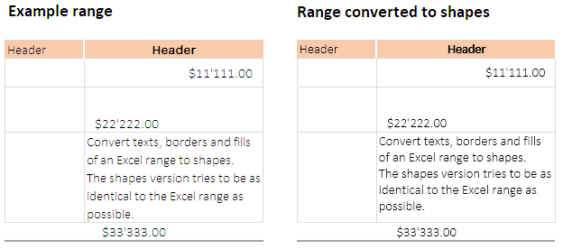

# Convert an Excel range to shapes

Convert texts, borders and fills of an Excel range to shapes.  

The converted shapes version tries to be as identical to the Excel range as possible:



## Motivation

I was not satisfied with any of the pasting options:

- Pasting and keeping formats often leads to misalignments and changes of the size.
- If pasted as image or embedded the quality is bad.

Therefore I developed this conversions tool that I use a lot at work. I use it in conjunction with another tool that lets me copy ranges from excel files to PowerPoint. I plan to publish this soon.

## Installation

- **Download workbook**: You can download [ConvertRangeToShapes.xlsm](../../raw/master/ConvertRangeToShapes.xlsm). This workbook inlcudes the class and a module with examples on how to use the class. See [remark](#Remark-for-the-workbook).
- **Copy code**: Copy the class code starting at line 10 `Option Explicit` from [raw](../../raw/master/ConvertRangeToShapes.cls) and paste into a new class in your workbook.
- **Import class into workbook**: Clone or [download](../../archive/master.zip) the repository and import the file ConvertRangeToShapes.cls into your workbook to use the class.

## Usage

The main method to use is `convertAll`.  
> Convert borders, fills and texts in an Excel range to shapes. Deletes existing shapes with the same name beforehand and selects the shapes after to copy them.

Public methods (see docstrings in VBA code for more details):

<dl>
  <dt><code>convertAll</code></dt>
  <dd>Convert an Excel range (texts, borders, fills) to shapes.</dd>
  <dt><code>convertBorders</code></dt>
  <dd>Convert borders in range to shapes.</dd>
  <dt><code>convertFills</code></dt>
  <dd>Convert fills in range to shapes.</dd>
  <dt><code>convertTexts</code></dt>
  <dd>Convert texts in range to shapes.</dd>
  <dt><code>setShapesName</code></dt>
  <dd>Set the global name for the shapes.</dd>
  <dt><code>deleteShapes</code></dt>
  <dd>Delete shapes with specified name in a workskheet.</dd>
  <dt><code>selectShapes</code></dt>
  <dd>Select shapes with specified name in a workskheet.</dd>
  <dd></dd>
</dl>

### Remark for texts

Make sure to explicitly set the text alignment to be able to copy the alignment for the shapes. Else it can lead to not identically aligned texts. If a text spans multiple cells the cells need to be merged to make the shape cover the same range. Else the text might get trunctuated.

### Examples

```vb
Sub convertAll()
    Dim x As New ConvertRangeToShapes
    ' Convert borders, fill and text. Ignore white fill.
    x.convertAll ThisWorkbook.Worksheets("-").Range("B8:C12"), "all", RGB(255, 255, 255)
End Sub

Sub convertBordersOnly()
    Dim x As New ConvertRangeToShapes
    ' Convert borders only. Delete and select is only run automatically when using convertAll
    x.deleteShapes ThisWorkbook.Worksheets("-"), "exampleBorders"
    x.convertBorders ThisWorkbook.Worksheets("-").Range("B8:C12"), "exampleBorders"
    x.selectShapes ThisWorkbook.Worksheets("-"), "exampleBorders"
End Sub

Sub convertFillsOnly()
    Dim x As New ConvertRangeToShapes
    ' Convert fills only.
    x.deleteShapes ThisWorkbook.Worksheets("-"), "exampleFills"
    x.convertFills ThisWorkbook.Worksheets("-").Range("B8:C12"), , "exampleFills"
    x.selectShapes ThisWorkbook.Worksheets("-"), "exampleFills"
End Sub

Sub convertFillsOnlyIgnoreWhite()
    Dim x As New ConvertRangeToShapes
    ' Convert fills only. Use setName to not have to repeat the name.
    x.setShapesName "exampleFills1"
    x.deleteShapes ThisWorkbook.Worksheets("-")
    x.convertFills ThisWorkbook.Worksheets("-").Range("B8:C12"), RGB(255, 255, 255)
    x.selectShapes ThisWorkbook.Worksheets("-")
End Sub

Sub convertTextsOnly()
    Dim x As New ConvertRangeToShapes
    ' Convert texts only.
    x.deleteShapes ThisWorkbook.Worksheets("-"), "exampleTexts"
    x.convertTexts ThisWorkbook.Worksheets("-").Range("B8:C12"), "exampleTexts"
    x.selectShapes ThisWorkbook.Worksheets("-"), "exampleTexts"
End Sub

Sub deleteAll()
    Dim x As New ConvertRangeToShapes
    ' Using wildcard to delete all.
    x.deleteShapes ThisWorkbook.Worksheets("-"), "example*"
End Sub
```

## Remark for the workbook

The class module gets automatically exported by using the CodeExportImport class when saving. To stop this behavior change the constant in the module "autoopen" to "False".
```vb
Private Const is_in_development As Boolean = False
```

Or delete the autoopen module and the CodeExportImport class.

## Contributing

If you find a bug, please create a new issue. Pull requests are also welcome.

## Contributors

- [Daniel Hubmann](https://github.com/hubisan) (Author)

## License

Copyright (c) 2019 Daniel Hubmann. Licensed under [MIT](LICENSE).
